# Header 购物车总价显示

## ✨ 功能说明

Header 的购物车图标右侧现在会**实时显示购物车的总价格**。

---

## 📊 工作流程

```mermaid
graph LR
    A[用户添加商品] --> B[Redux Store 更新]
    B --> C[selectCartTotalPrice 计算总价]
    C --> D[Header 自动更新显示]
    
    style A fill:#4CAF50,color:#fff
    style D fill:#2196F3,color:#fff
```



---

## 🔧 实现细节

### 1. 导入 Selector

```javascript
import { selectCartTotalItems, selectCartTotalPrice } from "../../../store/cartSlice";
```

### 2. 使用 useSelector 获取总价

```javascript
function Header({ onSignInClick, onHomeClick, onCartClick, isLoggedIn }) {
  const totalItems = useSelector(selectCartTotalItems);
  const totalPrice = useSelector(selectCartTotalPrice);  // 🆕 获取总价
  
  // ...
}
```

### 3. 显示总价

```javascript
<span className="cart-price">${totalPrice.toFixed(2)}</span>
```

---

## 💡 示例

### 场景 1：空购物车

```
显示：🛒 $0.00
```

### 场景 2：添加商品

```
购物车内容：
- Product A: $99.99 × 2 = $199.98
- Product B: $49.99 × 1 = $49.99

显示：🛒 2 $249.97
       ↑   ↑
    数量  总价
```

### 场景 3：实时更新

```
1. 初始状态：🛒 $0.00

2. 添加商品 A ($99.99)：
   🛒 1 $99.99

3. 增加商品 A 数量到 2：
   🛒 2 $199.98

4. 添加商品 B ($49.99)：
   🛒 3 $249.97

5. 删除商品 A：
   🛒 1 $49.99
```

---

## 🎯 Redux Selector

`selectCartTotalPrice` 的实现（在 `cartSlice.js` 中）：

```javascript
export const selectCartTotalPrice = (state) =>
  state.cart.items.reduce((total, item) => total + item.price * item.quantity, 0);
```

**计算逻辑**：
- 遍历购物车中的所有商品
- 每个商品的价格 × 数量
- 累加得到总价

---

## ✅ 优势

1. **实时更新**：任何购物车变化都会立即反映在 Header 上
2. **性能优化**：使用 Redux selector，只有总价变化时才重新渲染
3. **精确显示**：使用 `.toFixed(2)` 确保显示两位小数

---

## 🎨 UI 效果

```
┌─────────────────────────────────────────────────┐
│  Management Chuwa    [Search...]    👤 Sign In  │
│                                                  │
│                                      🛒 2 $249.97│
│                                       ↑   ↑      │
│                                    数量  总价     │
└─────────────────────────────────────────────────┘
```

---

## 🔍 调试

在浏览器控制台查看总价计算：

```javascript
// 查看购物车商品
console.log(store.getState().cart.items);

// 手动计算总价
const items = store.getState().cart.items;
const total = items.reduce((sum, item) => sum + item.price * item.quantity, 0);
console.log('Total:', total);
```

---

## 📝 相关文件

- `src/assets/components/Header/index.jsx` - Header 组件
- `src/store/cartSlice.js` - Redux slice（包含 selectCartTotalPrice）

---

现在 Header 会实时显示购物车的总价格！🎉
