# Redux 购物车实现 - 学习指南

## 📚 目录
1. [整体架构](#整体架构)
2. [数据流程](#数据流程)
3. [文件结构](#文件结构)
4. [核心概念](#核心概念)
5. [代码对比](#代码对比)
6. [实际应用](#实际应用)

---

## 🏗️ 整体架构

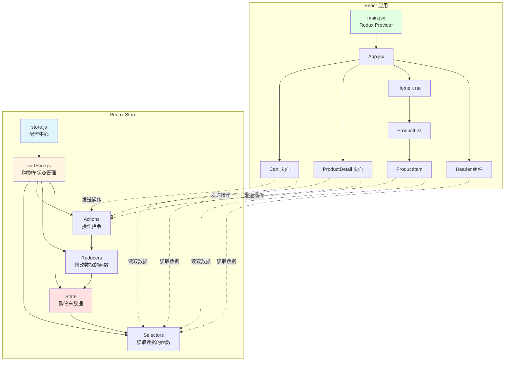

---

## 🔄 数据流程图

### 1. 添加商品到购物车的完整流程

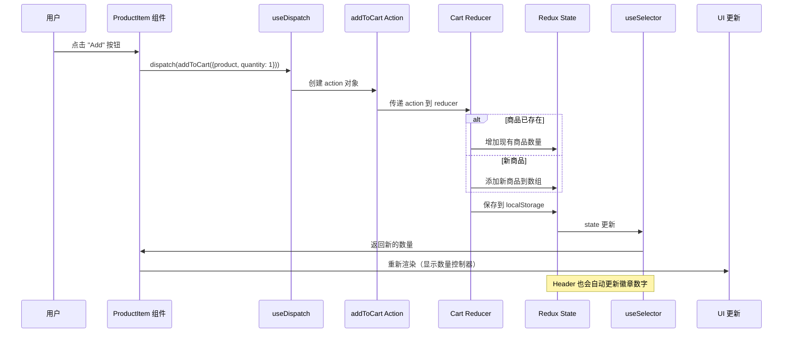

### 2. Redux vs Context API 数据流对比

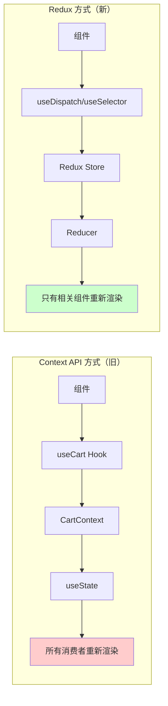

---

## 📁 文件结构变化

### 新增文件

```
src/
├── store/                          # 🆕 Redux 相关文件
│   ├── store.js                   # 🆕 Redux store 配置
│   └── cartSlice.js               # 🆕 购物车 slice
│
├── context/
│   ├── AuthContext.jsx            # ✅ 保留（用户认证）
│   └── CartContext.jsx            # ⚠️ 可以删除（已被 Redux 替代）
│
├── assets/components/
│   ├── Header/
│   │   └── index.jsx              # 🔄 修改（使用 Redux）
│   └── Products/
│       └── ProductItem.jsx        # 🔄 修改（使用 Redux）
│
├── pages/
│   ├── Cart.jsx                   # 🔄 修改（使用 Redux）
│   └── ProductDetail.jsx          # 🔄 修改（使用 Redux）
│
└── main.jsx                       # 🔄 修改（使用 Redux Provider）
```

---

## 🎯 核心概念详解

### 1. Redux Store（仓库）

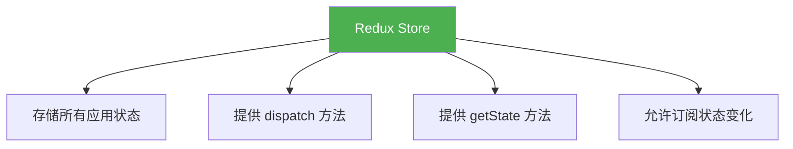

**代码示例：**
```javascript
// store/store.js
import { configureStore } from '@reduxjs/toolkit';
import cartReducer from './cartSlice';

export const store = configureStore({
  reducer: {
    cart: cartReducer,  // 购物车状态
    // 未来可以添加更多：
    // auth: authReducer,
    // products: productsReducer,
  },
});
```

---

### 2. Slice（切片）

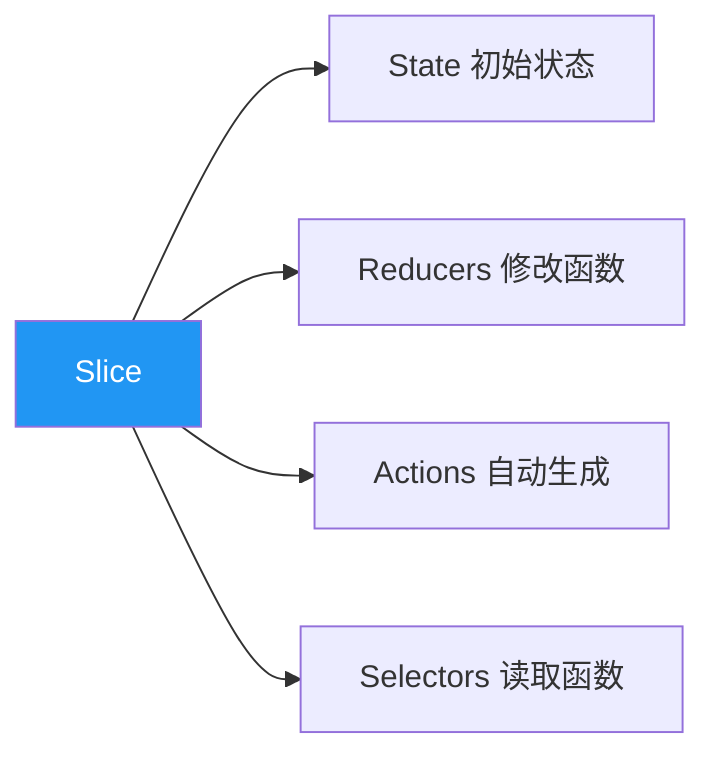

**Slice 包含什么？**

```javascript
// store/cartSlice.js
const cartSlice = createSlice({
  name: 'cart',                    // 1️⃣ 名称
  initialState: { items: [] },     // 2️⃣ 初始状态
  reducers: {                      // 3️⃣ Reducers
    addToCart: (state, action) => {
      // 修改 state 的逻辑
    },
    updateQuantity: (state, action) => {
      // 修改 state 的逻辑
    },
  },
});

// 4️⃣ 导出 Actions（自动生成）
export const { addToCart, updateQuantity } = cartSlice.actions;

// 5️⃣ 导出 Selectors（手动编写）
export const selectCartItems = (state) => state.cart.items;

// 6️⃣ 导出 Reducer
export default cartSlice.reducer;
```

---

### 3. Actions（动作）

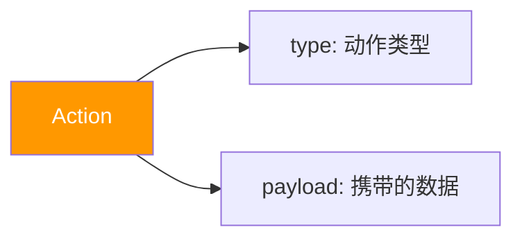

**Action 的结构：**

```javascript
// 当你调用：
dispatch(addToCart({ product, quantity: 1 }))

// Redux 会创建这样的 action 对象：
{
  type: 'cart/addToCart',           // 自动生成的类型
  payload: {                        // 你传入的数据
    product: { id: 1, name: '...', price: 99 },
    quantity: 1
  }
}
```

---

### 4. Reducers（归约器）

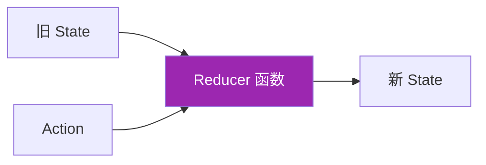

**Reducer 的工作原理：**

```javascript
// Reducer 是纯函数：(state, action) => newState
reducers: {
  addToCart: (state, action) => {
    const { product, quantity } = action.payload;
    const existingItem = state.items.find(item => item.id === product.id);
    
    if (existingItem) {
      // 商品已存在，增加数量
      existingItem.quantity += quantity;
    } else {
      // 新商品，添加到数组
      state.items.push({ ...product, quantity });
    }
    
    // Redux Toolkit 使用 Immer，可以直接修改 state
    // 实际上会创建新的不可变对象
  },
}
```

---

### 5. Selectors（选择器）

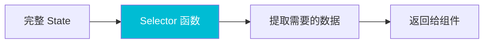

**Selector 的作用：**

```javascript
// 简单 selector
export const selectCartItems = (state) => state.cart.items;

// 计算型 selector
export const selectCartTotalItems = (state) =>
  state.cart.items.reduce((total, item) => total + item.quantity, 0);

// 参数化 selector
export const selectItemQuantity = (productId) => (state) => {
  const item = state.cart.items.find(item => item.id === productId);
  return item ? item.quantity : 0;
};
```

---

## 🔄 代码对比：Context API vs Redux

### 方式 1：Context API（旧方式）

```javascript
// ❌ 旧方式：使用 Context API

// 1. 创建 Context
const CartContext = createContext();

// 2. 创建 Provider
function CartProvider({ children }) {
  const [cartItems, setCartItems] = useState([]);
  
  const addToCart = (product, quantity) => {
    setCartItems(prev => {
      const existing = prev.find(item => item.id === product.id);
      if (existing) {
        return prev.map(item =>
          item.id === product.id
            ? { ...item, quantity: item.quantity + quantity }
            : item
        );
      }
      return [...prev, { ...product, quantity }];
    });
  };
  
  return (
    <CartContext.Provider value={{ cartItems, addToCart }}>
      {children}
    </CartContext.Provider>
  );
}

// 3. 在组件中使用
function ProductItem({ product }) {
  const { addToCart } = useCart();  // 自定义 hook
  
  const handleAdd = () => {
    addToCart(product, 1);
  };
  
  return <button onClick={handleAdd}>Add</button>;
}
```

### 方式 2：Redux（新方式）

```javascript
// ✅ 新方式：使用 Redux

// 1. 创建 Slice
const cartSlice = createSlice({
  name: 'cart',
  initialState: { items: [] },
  reducers: {
    addToCart: (state, action) => {
      const { product, quantity } = action.payload;
      const existing = state.items.find(item => item.id === product.id);
      if (existing) {
        existing.quantity += quantity;
      } else {
        state.items.push({ ...product, quantity });
      }
    },
  },
});

export const { addToCart } = cartSlice.actions;

// 2. 配置 Store
const store = configureStore({
  reducer: { cart: cartSlice.reducer },
});

// 3. 在组件中使用
function ProductItem({ product }) {
  const dispatch = useDispatch();  // Redux hook
  
  const handleAdd = () => {
    dispatch(addToCart({ product, quantity: 1 }));
  };
  
  return <button onClick={handleAdd}>Add</button>;
}
```

---

## 📊 组件使用示例

### 1. Header 组件 - 读取购物车数量

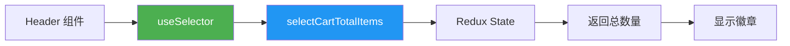

**代码：**
```javascript
import { useSelector } from "react-redux";
import { selectCartTotalItems } from "../../../store/cartSlice";

function Header() {
  // 📖 读取数据：使用 useSelector
  const totalItems = useSelector(selectCartTotalItems);
  
  return (
    <div className="cart-icon-wrapper">
      <MdOutlineShoppingCart className="cart-icon" />
      {totalItems > 0 && (
        <span className="cart-badge">{totalItems}</span>
      )}
    </div>
  );
}
```

---

### 2. ProductItem 组件 - 添加商品

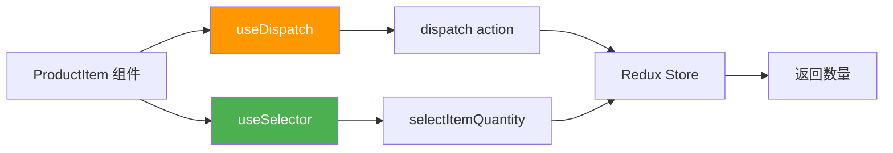

**代码：**
```javascript
import { useDispatch, useSelector } from "react-redux";
import { addToCart, updateQuantity, selectItemQuantity } from "../../../store/cartSlice";

function ProductItem({ product }) {
  // 📤 发送操作：使用 useDispatch
  const dispatch = useDispatch();
  
  // 📖 读取数据：使用 useSelector
  const quantity = useSelector(selectItemQuantity(product.id));
  
  const handleAdd = () => {
    // 发送 action
    dispatch(addToCart({ product, quantity: 1 }));
  };
  
  const handleIncrement = () => {
    dispatch(updateQuantity({ 
      productId: product.id, 
      quantity: quantity + 1 
    }));
  };
  
  return (
    <div>
      {quantity === 0 ? (
        <button onClick={handleAdd}>Add</button>
      ) : (
        <div>
          <button onClick={handleDecrement}>-</button>
          <span>{quantity}</span>
          <button onClick={handleIncrement}>+</button>
        </div>
      )}
    </div>
  );
}
```

---

### 3. Cart 页面 - 管理购物车

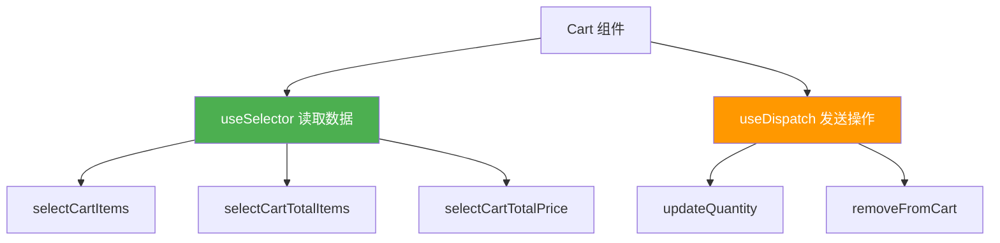

**代码：**
```javascript
import { useDispatch, useSelector } from "react-redux";
import { 
  selectCartItems, 
  selectCartTotalItems, 
  selectCartTotalPrice,
  updateQuantity,
  removeFromCart 
} from "../store/cartSlice";

function Cart() {
  const dispatch = useDispatch();
  
  // 📖 读取多个数据
  const cartItems = useSelector(selectCartItems);
  const totalItems = useSelector(selectCartTotalItems);
  const totalPrice = useSelector(selectCartTotalPrice);
  
  // 📤 定义操作函数
  const handleIncrement = (productId, currentQuantity) => {
    dispatch(updateQuantity({ 
      productId, 
      quantity: currentQuantity + 1 
    }));
  };
  
  const handleRemove = (productId) => {
    dispatch(removeFromCart(productId));
  };
  
  return (
    <div>
      <h1>Cart ({totalItems})</h1>
      {cartItems.map(item => (
        <div key={item.id}>
          <span>{item.name}</span>
          <span>{item.quantity}</span>
          <button onClick={() => handleIncrement(item.id, item.quantity)}>
            +
          </button>
          <button onClick={() => handleRemove(item.id)}>
            Remove
          </button>
        </div>
      ))}
      <div>Total: ${totalPrice.toFixed(2)}</div>
    </div>
  );
}
```

---

## 🎓 关键学习点

### 1. Redux 的三大原则

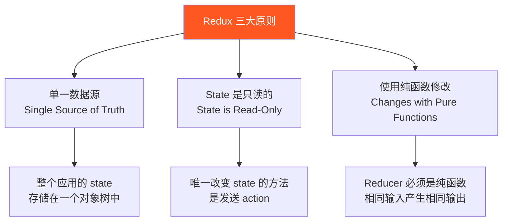

### 2. 数据流向（单向数据流）

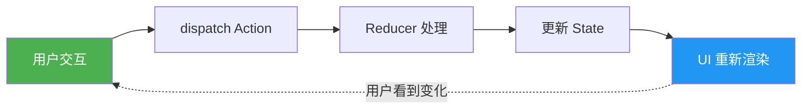

### 3. Redux Toolkit 的优势

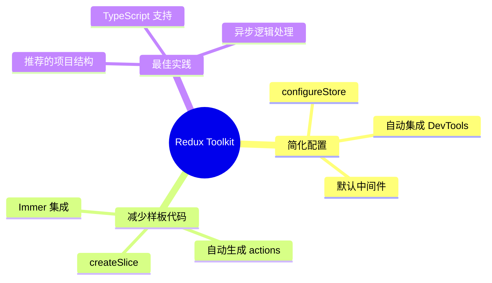

---

## 🔍 调试技巧

### 使用 Redux DevTools

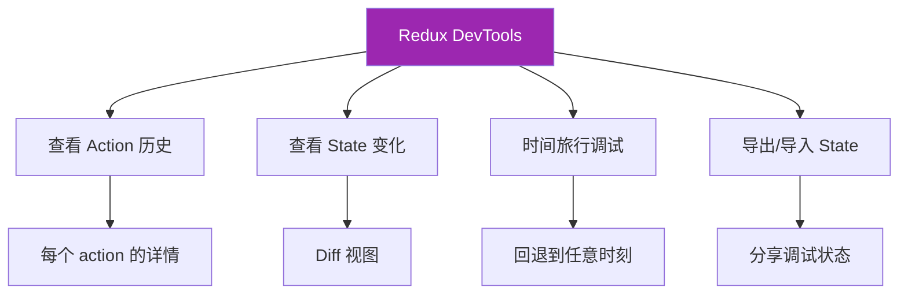

**如何使用：**
1. 安装 Redux DevTools 浏览器扩展
2. 打开浏览器开发者工具
3. 切换到 "Redux" 标签
4. 查看所有 dispatched actions 和 state 变化

---

## 📝 总结

### Redux 工作流程总览

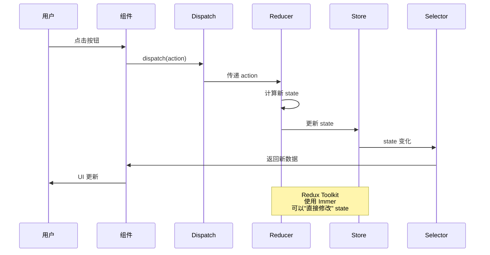

### 核心 API 速查

| API | 用途 | 示例 |
|-----|------|------|
| `useSelector` | 从 Redux store 读取数据 | `const items = useSelector(selectCartItems)` |
| `useDispatch` | 获取 dispatch 函数 | `const dispatch = useDispatch()` |
| `dispatch` | 发送 action | `dispatch(addToCart({ product, quantity: 1 }))` |
| `createSlice` | 创建 slice | `createSlice({ name, initialState, reducers })` |
| `configureStore` | 配置 store | `configureStore({ reducer: { cart: cartReducer } })` |

---

## 🎯 下一步学习

1. **Redux Thunk** - 处理异步操作（API 调用）
2. **Redux Persist** - 更高级的持久化方案
3. **Reselect** - 创建记忆化的 selectors
4. **RTK Query** - Redux Toolkit 的数据获取工具
5. **TypeScript** - 为 Redux 添加类型安全

---

## 💡 最佳实践

1. ✅ 使用 Redux Toolkit，不要使用传统 Redux
2. ✅ 将 selectors 定义在 slice 文件中
3. ✅ 使用 TypeScript 获得更好的类型安全
4. ✅ 保持 reducers 纯净（无副作用）
5. ✅ 使用 Redux DevTools 调试
6. ✅ 合理拆分 slices（按功能模块）
7. ✅ 使用 Immer 简化不可变更新

---

希望这份指南能帮助你理解 Redux 的工作原理！🎉
