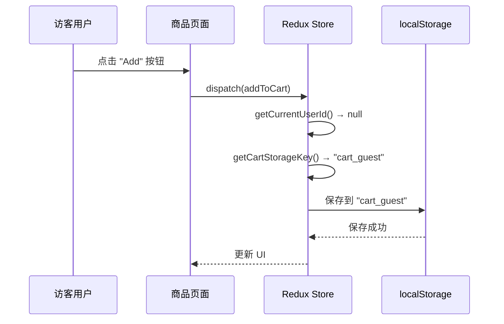
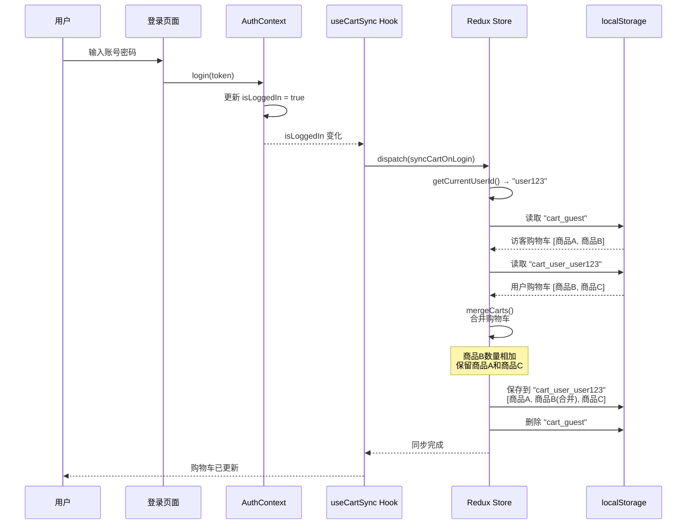
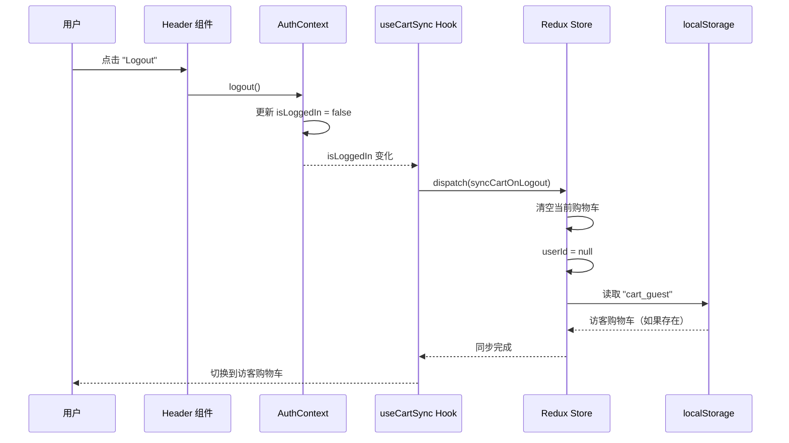
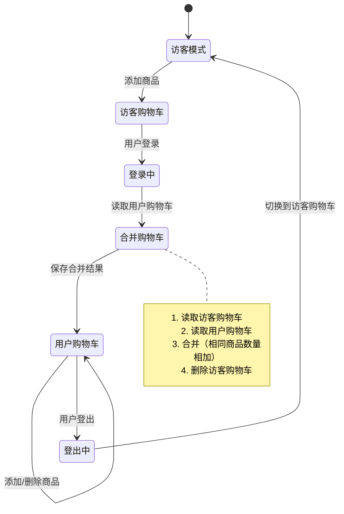

# 用户特定购物车实现说明

## 🎯 功能概述

实现了**用户特定的购物车**功能，支持：
1. ✅ 访客购物车（未登录用户）
2. ✅ 用户购物车（登录用户，每个用户独立）
3. ✅ 登录时自动合并访客购物车到用户购物车
4. ✅ 登出时切换回访客购物车

---

## 📊 工作流程图

### 1. 访客添加商品到购物车



### 2. 用户登录时合并购物车



### 3. 用户登出时切换购物车



---

## 🗂️ localStorage 存储结构

### 存储键（Key）规则

```javascript
// 访客购物车
"cart_guest" → [
  { id: "1", name: "Product A", price: 99, quantity: 2 },
  { id: "2", name: "Product B", price: 49, quantity: 1 }
]

// 用户购物车（每个用户独立）
"cart_user_user123" → [
  { id: "2", name: "Product B", price: 49, quantity: 3 },
  { id: "3", name: "Product C", price: 199, quantity: 1 }
]

"cart_user_user456" → [
  { id: "4", name: "Product D", price: 299, quantity: 1 }
]

// 认证 token
"accessToken" → "eyJhbGciOiJIUzI1NiIsInR5cCI6IkpXVCJ9..."
```

---

## 🔑 核心实现

### 1. 获取用户 ID

```javascript
const getCurrentUserId = () => {
  try {
    const token = localStorage.getItem('accessToken');
    if (!token) return null;
    
    // 解析 JWT token 获取用户信息
    const payload = JSON.parse(atob(token.split('.')[1]));
    return payload.userId || payload.id || payload.sub;
  } catch (error) {
    console.error('Error parsing token:', error);
    return null;
  }
};
```

**说明**：
- JWT token 格式：`header.payload.signature`
- 使用 `atob()` 解码 Base64 编码的 payload
- 支持多种用户 ID 字段名（userId, id, sub）

---

### 2. 动态购物车存储键

```javascript
const getCartStorageKey = () => {
  const userId = getCurrentUserId();
  return userId ? `cart_user_${userId}` : 'cart_guest';
};
```

**逻辑**：
- 已登录：`cart_user_{userId}`
- 未登录：`cart_guest`

---

### 3. 购物车合并算法

```javascript
const mergeCarts = (guestCart, userCart) => {
  const merged = [...userCart];
  
  guestCart.forEach(guestItem => {
    const existingIndex = merged.findIndex(item => item.id === guestItem.id);
    
    if (existingIndex >= 0) {
      // 商品已存在，合并数量
      merged[existingIndex].quantity += guestItem.quantity;
    } else {
      // 新商品，添加到购物车
      merged.push(guestItem);
    }
  });
  
  return merged;
};
```

**合并规则**：
- 相同商品：数量相加
- 不同商品：全部保留

**示例**：
```javascript
// 访客购物车
guestCart = [
  { id: "1", name: "A", quantity: 2 },
  { id: "2", name: "B", quantity: 1 }
]

// 用户购物车
userCart = [
  { id: "2", name: "B", quantity: 3 },
  { id: "3", name: "C", quantity: 1 }
]

// 合并结果
merged = [
  { id: "2", name: "B", quantity: 4 },  // 1 + 3 = 4
  { id: "3", name: "C", quantity: 1 },
  { id: "1", name: "A", quantity: 2 }
]
```

---

### 4. Redux Actions

#### syncCartOnLogin - 登录时同步

```javascript
syncCartOnLogin: (state) => {
  const newUserId = getCurrentUserId();
  
  if (newUserId && newUserId !== state.userId) {
    // 1. 保存当前访客购物车
    const guestCart = [...state.items];
    
    // 2. 加载用户购物车
    const userCartKey = `cart_user_${newUserId}`;
    let userCart = [];
    try {
      const savedUserCart = localStorage.getItem(userCartKey);
      userCart = savedUserCart ? JSON.parse(savedUserCart) : [];
    } catch (error) {
      console.error('Error loading user cart:', error);
    }
    
    // 3. 合并购物车
    state.items = mergeCarts(guestCart, userCart);
    state.userId = newUserId;
    
    // 4. 保存合并后的购物车
    saveCartToStorage(state.items);
    
    // 5. 清除访客购物车
    try {
      localStorage.removeItem('cart_guest');
    } catch (error) {
      console.error('Error removing guest cart:', error);
    }
  }
}
```

#### syncCartOnLogout - 登出时同步

```javascript
syncCartOnLogout: (state) => {
  // 1. 清空当前购物车
  state.items = [];
  state.userId = null;
  
  // 2. 加载访客购物车
  try {
    const guestCart = localStorage.getItem('cart_guest');
    state.items = guestCart ? JSON.parse(guestCart) : [];
  } catch (error) {
    console.error('Error loading guest cart:', error);
  }
}
```

---

### 5. 自动同步 Hook

```javascript
// hooks/useCartSync.js
import { useEffect } from 'react';
import { useDispatch } from 'react-redux';
import { syncCartOnLogin, syncCartOnLogout } from '../store/cartSlice';
import { useAuth } from '../context/AuthContext';

export function useCartSync() {
  const dispatch = useDispatch();
  const { isLoggedIn } = useAuth();

  useEffect(() => {
    if (isLoggedIn) {
      // 用户登录，同步购物车
      dispatch(syncCartOnLogin());
    } else {
      // 用户登出，切换到访客购物车
      dispatch(syncCartOnLogout());
    }
  }, [isLoggedIn, dispatch]);
}
```

**工作原理**：
- 监听 `isLoggedIn` 状态变化
- 登录时自动调用 `syncCartOnLogin`
- 登出时自动调用 `syncCartOnLogout`

---

## 📝 使用示例

### 场景 1：访客添加商品

```javascript
// 1. 访客浏览商品
// localStorage: cart_guest = []

// 2. 添加商品 A
dispatch(addToCart({ product: productA, quantity: 1 }))
// localStorage: cart_guest = [{ id: "A", quantity: 1 }]

// 3. 添加商品 B
dispatch(addToCart({ product: productB, quantity: 2 }))
// localStorage: cart_guest = [
//   { id: "A", quantity: 1 },
//   { id: "B", quantity: 2 }
// ]
```

---

### 场景 2：访客登录（购物车合并）

```javascript
// 登录前状态
// localStorage: {
//   cart_guest: [{ id: "A", quantity: 1 }, { id: "B", quantity: 2 }],
//   cart_user_user123: [{ id: "B", quantity: 3 }, { id: "C", quantity: 1 }]
// }

// 用户登录
login(token) // token 包含 userId: "user123"

// useCartSync 自动触发
// dispatch(syncCartOnLogin())

// 登录后状态
// localStorage: {
//   cart_user_user123: [
//     { id: "B", quantity: 5 },  // 2 + 3 = 5
//     { id: "C", quantity: 1 },
//     { id: "A", quantity: 1 }
//   ]
//   // cart_guest 已被删除
// }
```

---

### 场景 3：用户登出

```javascript
// 登出前状态
// localStorage: {
//   cart_user_user123: [
//     { id: "B", quantity: 5 },
//     { id: "C", quantity: 1 },
//     { id: "A", quantity: 1 }
//   ]
// }

// 用户登出
logout()

// useCartSync 自动触发
// dispatch(syncCartOnLogout())

// 登出后状态
// Redux state: {
//   items: [],  // 清空
//   userId: null
// }
// localStorage: {
//   cart_user_user123: [...] // 保留用户购物车
//   cart_guest: []  // 空的访客购物车
// }
```

---

### 场景 4：切换账号

```javascript
// 用户 A 登录
login(tokenA) // userId: "userA"
// localStorage: cart_user_userA

// 添加商品
dispatch(addToCart({ product, quantity: 1 }))
// localStorage: cart_user_userA = [{ id: "1", quantity: 1 }]

// 用户 A 登出
logout()
// localStorage: cart_guest = []

// 用户 B 登录
login(tokenB) // userId: "userB"
// localStorage: cart_user_userB
// 用户 B 看到的是自己的购物车，不是用户 A 的
```

---

## 🎨 状态流转图



---

## 🔍 调试技巧

### 1. 查看 localStorage

```javascript
// 在浏览器控制台
console.log('访客购物车:', localStorage.getItem('cart_guest'));
console.log('用户购物车:', localStorage.getItem('cart_user_user123'));
console.log('Token:', localStorage.getItem('accessToken'));
```

### 2. 查看 Redux State

使用 Redux DevTools：
1. 打开浏览器开发者工具
2. 切换到 "Redux" 标签
3. 查看 `cart.items` 和 `cart.userId`

### 3. 监听购物车同步

```javascript
// 在 useCartSync hook 中添加日志
useEffect(() => {
  console.log('🔄 Auth state changed:', { isLoggedIn });
  if (isLoggedIn) {
    console.log('📥 Syncing cart on login...');
    dispatch(syncCartOnLogin());
  } else {
    console.log('📤 Syncing cart on logout...');
    dispatch(syncCartOnLogout());
  }
}, [isLoggedIn, dispatch]);
```

---

## ⚠️ 注意事项

### 1. Token 格式要求

确保后端返回的 JWT token 包含用户 ID：

```json
{
  "userId": "user123",  // 或 "id" 或 "sub"
  "email": "user@example.com",
  "role": "user",
  "exp": 1234567890
}
```

### 2. 购物车数据结构

商品对象必须包含 `id` 字段：

```javascript
{
  id: "product123",  // ✅ 必需
  name: "Product Name",
  price: 99.99,
  quantity: 1,
  // 其他字段...
}
```

### 3. 并发问题

如果用户在多个标签页同时操作：
- localStorage 会自动同步
- Redux state 可能不同步
- 建议：监听 `storage` 事件同步多标签页

---

## 🚀 未来优化

### 1. 服务器端购物车

```javascript
// 将购物车保存到服务器
const syncCartToServer = async (cartItems) => {
  await fetch('/api/cart', {
    method: 'POST',
    headers: {
      'Authorization': `Bearer ${token}`,
      'Content-Type': 'application/json',
    },
    body: JSON.stringify({ items: cartItems }),
  });
};
```

### 2. 多设备同步

- 登录时从服务器加载购物车
- 修改时实时同步到服务器
- 支持多设备购物车同步

### 3. 购物车过期

```javascript
// 添加时间戳
const cartItem = {
  ...product,
  quantity,
  addedAt: Date.now(),
};

// 清理过期商品（例如 30 天）
const cleanExpiredItems = (items) => {
  const thirtyDaysAgo = Date.now() - 30 * 24 * 60 * 60 * 1000;
  return items.filter(item => item.addedAt > thirtyDaysAgo);
};
```

---

## 📚 相关文件

- `src/store/cartSlice.js` - Redux slice 实现
- `src/hooks/useCartSync.js` - 自动同步 Hook
- `src/App.jsx` - 使用 Hook
- `src/context/AuthContext.jsx` - 认证上下文

---

## ✅ 测试清单

- [ ] 访客添加商品到购物车
- [ ] 访客登录后购物车合并
- [ ] 登录用户添加商品
- [ ] 登录用户登出后购物车清空
- [ ] 切换不同账号，购物车独立
- [ ] 刷新页面，购物车保持
- [ ] 多个商品数量正确合并

---

希望这份文档能帮助你理解用户特定购物车的实现！🎉
